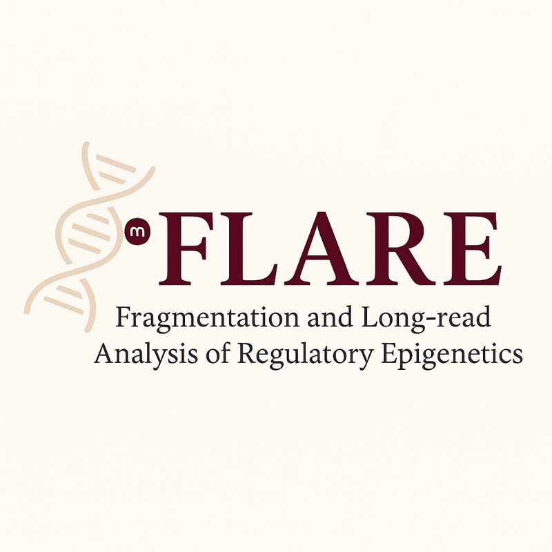

<h1>
  
  Nome del Progetto
</h1>
# Fragmenting the Future with FLARE: A Comprehensive Fragmentomics Pipeline Based on Long-read Nanopore Sequencing 
After sequencing, the raw signal data were used for basecalling with the Dorado 
basecaller, and the resulting reads were aligned to the human reference genome 
(hg38) using minimap2. Tumor fraction and copy number variations (CNVs) were 
estimated using the HMMcopy and ichorCNA packages from Bioconductor/R. 

For motif analysis, we extracted the first four nucleotides at the 5′ end of each 
aligned read using a method based on that described in Katsman et al., 2022. To 
reduce complexity and identify recurring patterns among samples, Non-negative 
Matrix Factorization (NMF) was applied to the matrix of motif frequencies. This 
approach allowed the extraction of three main profiles, each characterized by a 
specific set of dominant motifs, representing underlying patterns that explain 
the variability observed among the samples.

## Basecalling and Demultiplexing

### Command Basacaling

```bash
/path/to/dorado/bin/dorado basecaller hac \
  --modified-bases 5mCG_5hmCG \
  --emit-moves \
  --device cuda:all \
  --kit-name \
  --no-trim \
  --reference /path/to/reference/genome.fa \
  /path/to/input_pod5_directory \
  | samtools view -b -o /path/to/output/output_pass.bam


```
### Command Demultiplexing
```bash
dorado demux \
  --output-dir ./bam_demuxed \
  --no-classify \
  output_pass.bam

```

### Reference
- Dorado: [https://github.com/nanoporetech/dorado](https://github.com/nanoporetech/dorado)

### Alignment and Filtering with minimap2 
Before aligning reads with minimap2, you need to create an index (`.mmi`) from the reference genome FASTA file.  
```bash
/path/to/minimap2 -d /path/to/reference_genome.mmi /path/to/reference_genome.fa
```
- Genome Reference: https://hgdownload.soe.ucsc.edu/goldenpath/hg38/bigZips/p13/

```bash
# Convert BAM to FASTQ
samtools fastq -@ 4 -O -n /path/to/input.bam | gzip > /path/to/output.fastq.gz

# Align FASTQ to reference genome with minimap2 and filter reads
/path/to/minimap2 -ax map-ont --MD -L /path/to/hg38.p13.mmi /path/to/output.fastq.gz \
  | samtools view -h -q 20 -F 0x4 -F 0x100 -F 0x800 \
  | awk '( $9 < 700 || $1 ~ /^@/ )' \
  | samtools view -bS -o /path/to/output.filtered.bam
```

### Reference
- minimap2: https://github.com/lh3/minimap2
- Heng Li, Minimap2: pairwise alignment for nucleotide sequences, Bioinformatics, Volume 34, Issue 18, September 2018, Pages 3094–3100, https://doi.org/10.1093/bioinformatics/bty191

### Sorting and Indexing BAM Files

```bash
# Sort the filtered BAM file
samtools sort -@ 8 -o /path/to/output.sorted.bam /path/to/input.filtered.bam

# Index the sorted BAM file
samtools index /path/to/output.sorted.bam
```
### Generating Read Counts with readCounter (HMMcopy)
```bash
/path/to/readCounter --window 1000000 --quality 20 \
  --chromosome "chr1,chr2,chr3,chr4,chr5,chr6,chr7,chr8,chr9,chr10,chr11,chr12,chr13,chr14,chr15,chr16,chr17,chr18,chr19,chr20,chr21,chr22,chrX,chrY" \
  /path/to/input.filtered.sorted.bam > /path/to/output.filtered.sorted.wig
```  
### Reference
- HMMcopy: https://bioconductor.org/packages/release/bioc/html/HMMcopy.html

### Running ichorCNA for Tumor Fraction and CNV Analysis

```bash
# Create output directory
mkdir -p /path/to/ichorCNA_output

# Run ichorCNA
R_LIBS_USER=~/R/x86_64-pc-linux-gnu-library/4.5 \
Rscript /path/to/ichorCNA/scripts/runIchorCNA.R \
  --id SAMPLE_ID \
  --WIG /path/to/input.filtered.sorted.wig \
  --ploidy "c(2)" \
  --normal "c(0.95,0.99,0.995,0.999)" \
  --maxCN 3 \
  --gcWig /path/to/ichorCNA/extdata/gc_hg38_1000kb.wig \
  --mapWig /path/to/ichorCNA/extdata/map_hg38_1000kb.wig \
  --centromere /path/to/ichorCNA/extdata/GRCh38_centromere_acen.txt \
  --normalPanel /path/to/ichorCNA/extdata/HD_ULP_PoN_hg38_1Mb_median_normAutosome_median.rds \
  --includeHOMD False \
  --chrs "c(1:22, \"X\")" \
  --chrTrain "c(1:22)" \
  --estimateNormal True \
  --estimatePloidy True \
  --txnE 0.9999 \
  --txnStrength 10000 \
  --outDir /path/to/ichorCNA_output
```
### Reference
- ichorCNA: https://github.com/broadinstitute/ichorCNA
- Adalsteinsson, V.A., Ha, G., Freeman, S.S. et al. Scalable whole-exome sequencing of cell-free DNA reveals high concordance with metastatic tumors. Nat Commun 8, 1324 (2017). https://doi.org/10.1038/s41467-017-00965-y

## 🧬 Motif Analysis

For the analysis of 4-mer end motifs, a custom Python script was used: [motif_analysis.py](scripts/motif_analysis.py)
This script extracts end-motifs from Nanopore BAM files, generates frequency plots, pie charts of base composition, and outputs the top 20 motifs with counts and frequencies, along with a log file of filtering statistics.

The approach is based on the method described in **[Katsman et al., 2022]**, adapted for genome-wide cfDNA analysis.

**Usage example:**

```bash
python3 /path/to/motif_analysis.py \
  --bam /path/to/sample.filtered.bam \
  --reference /path/to/reference_genome.fa \
  --chromosomes /path/to/chr_list.txt \
  --sample SAMPLE_NAME
```
To reduce complexity and identify recurring patterns among samples, Non-negative Matrix Factorization (NMF) was applied to the matrix of motif frequencies. This approach allowed the extraction of three main profiles, each characterized by a specific set of dominant motifs, representing underlying patterns that explain the variability observed among the samples.

### Reference
- https://github.com/methylgrammarlab/Fragmentomics_GenomBiol
- Katsman, E., Orlanski, S., Martignano, F. et al. Detecting cell-of-origin and cancer-specific methylation features of cell-free DNA from Nanopore sequencing. Genome Biol 23, 158 (2022). https://doi.org/10.1186/s13059-022-02710-1
- NMF-package: https://github.com/renozao/NMF

### 📧 Contacts
If you have any questions or feedback, please contact us at:
- e-mail: marica.ficorilli@istitutotumori.mi.it   
  
 


